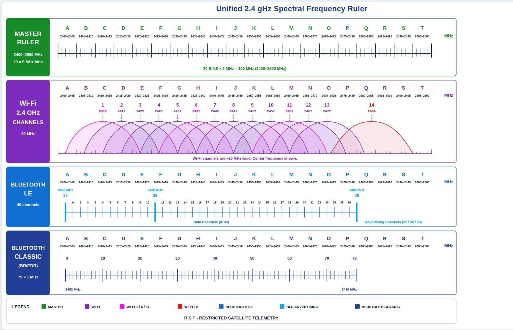

# Unified 2.4 gHz Spectral Frequency Ruler

A color-coded 2400–2500 MHz reference showing:

- Twenty lettered 5 MHz master frequency bins
- Wi-Fi 2.4 GHz channel overlap
- Bluetooth LE data and advertising channels
- Bluetooth Classic channels
- Restricted satellite-telemetry ranges

[Open or download the HTML ruler](Unified24GHzFrequencyRuler.html).

Permission is granted to use, copy, and share this work for noncommercial educational purposes. All other rights reserved.

© 2026 CoyoteLabs
